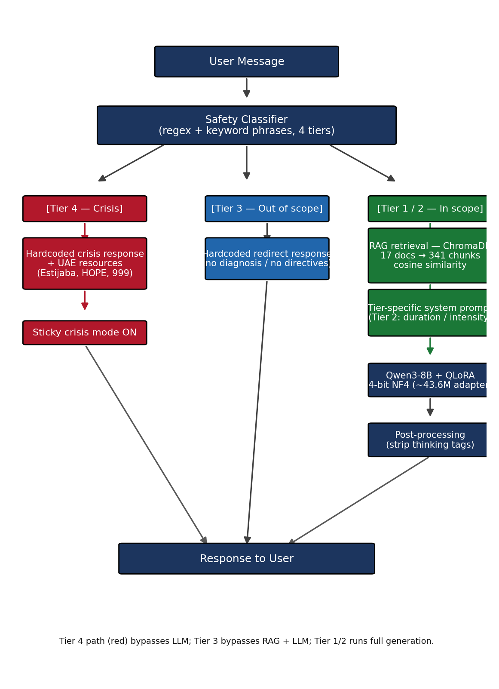

# 🧠 MindBridge — Mental Health Psychoeducation Bot

**CODS 641 — Natural Language Processing & Information Retrieval | Khalifa University | May 2026**
**Ali Almehairbi**

## Overview

A safety-aware psychoeducation chatbot built on Qwen3-8B using hybrid QLoRA fine-tuning and retrieval-augmented generation (RAG), with a four-tier safety architecture designed for UAE university deployment. MindBridge serves as a Socratic thinking partner — providing evidence-based psychoeducation without acting as a therapist.



## Key Results

| Metric | Value |
|--------|-------|
| Safety routing accuracy | 15/15 (100%) |
| Response relevance | 4.60/5.0 |
| Response safety | 4.93/5.0 |
| Socratic style | 3.67/5.0 |
| Inference latency (LLM) | ~10s |
| Inference latency (safety redirect) | <1ms |
| Peak GPU memory | 7.00 GB |
| Training loss | 2.905 → 1.014 |
| Validation loss | 1.018 (no overfitting) |

## Quick Start

```bash
# 1. Clone the repository
git clone https://github.com/Makkaii7/mental-health-psychoeducation-bot.git
cd mental-health-psychoeducation-bot

# 2. Install dependencies
pip install -r requirements.txt

# 3. Launch the chatbot
python -m src.app

# 4. Open in browser
# http://127.0.0.1:7860
```

## Architecture

MindBridge processes every user message through four sequential stages designed for safety, grounding, and clinical-tone awareness:

1. **Safety classifier** — A regex-based four-tier router (crisis → out-of-scope/jailbreak → with-care → general) runs before any model invocation. Tiers 3 and 4 short-circuit to hardcoded responses; tiers 1 and 2 proceed to the LLM.
2. **RAG retrieval** — For tiers 1 and 2, the user message is embedded with `all-MiniLM-L6-v2` and the top-3 chunks are pulled from a ChromaDB index over 17 curated NIMH/WHO/CDC/MedlinePlus documents (341 chunks total).
3. **Generation** — Qwen3-8B in 4-bit NF4 with a fine-tuned LoRA adapter (rank 16, 43.6 M trainable params on 8.2 B base) produces the response. A tier-2 system-prompt addon adds gentle duration/intensity probes.
4. **Post-processing** — `<think>` reasoning blocks are stripped, therapist identity claims are filtered, and emojis are removed for clinical tone.

## Project Structure

```
mental-health-psychoeducation-bot/
├── src/
│   ├── app.py             # Gradio UI (MindBridge front-end)
│   ├── chatbot.py         # End-to-end pipeline orchestrator
│   ├── safety.py          # Four-tier safety classifier + sticky session
│   ├── rag_pipeline.py    # ChromaDB retrieval over psychoeducation corpus
│   ├── data_prep.py       # CounselChat load → filter → ChatML format
│   ├── fine_tune.py       # QLoRA training (Unsloth or HF PEFT)
│   └── evaluate.py        # Ragas + safety red-team + latency/memory
├── config/
│   ├── config.yaml        # Model, training, RAG, safety knobs
│   └── crisis_keywords.txt
├── prompts/
│   ├── system_prompt.txt  # Socratic stance + RAG-grounding rules
│   └── safety_prompts.txt # Tier templates (YAML)
├── data/
│   ├── rag_corpus/        # 17 curated psychoeducation documents
│   └── processed/         # CounselChat splits (train/val/test, 600/75/75)
├── scripts/
│   ├── download_rag_corpus.py
│   ├── generate_evaluation_results.py
│   └── measure_latency_memory.py
├── notebooks/             # 01–05: data, training, RAG, eval, demo
├── report/
│   ├── report.tex         # CIE53 IEEE two-column conference paper
│   └── architecture.png
├── requirements.txt       # Pinned dependencies
└── evaluation_results.txt # Full pipeline run log (15 messages)
```

## Safety Tier System

| Tier | Trigger | Action |
|------|---------|--------|
| **1** General | Default psychoeducation queries | RAG + LLM, base Socratic prompt |
| **2** With care | Distress signals (anxiety, low mood, sleep, burnout) | RAG + LLM, tier-2 addon: duration/intensity check |
| **3** Out of scope | Diagnosis/prescription requests, jailbreak attempts, life decisions | Hardcoded redirect, no LLM call |
| **4** Crisis | Suicidal ideation, self-harm phrases | Hardcoded UAE crisis resources, **sticky** for the session |

Crisis routing is word-boundary regex over a curated keyword list, with apostrophe-insensitive matching and explicit false-positive suppression (e.g., "dye my hair" does not trigger).

## Dataset & RAG Corpus

**CounselChat (fine-tuning).** 2,775 therapist-answered questions → 750 filtered Q&A pairs after a multi-stage pipeline: missing-row removal (–163), upvote-then-length deduplication (→863 unique questions), and content filtering for psychoeducation fit (length bounds, directive-phrase count, topic gates, fit-score). Split 80/10/10 by **unique question text** to guarantee zero question-level leakage between train/val/test.

**RAG corpus (grounding).** 17 psychoeducation documents (≈18,600 body words) curated from authoritative public sources:
- 8 NIMH topic pages (depression, anxiety, PTSD, OCD, bipolar, psychotherapies, stress, mental-health care)
- 4 WHO fact sheets / Q&As (mental health, depression, anxiety, stress)
- 2 CDC mental-health pages
- 3 MedlinePlus articles (depression, anxiety, stress)

Documents are chunked at 500 chars (50-char overlap) into 341 chunks, embedded with `all-MiniLM-L6-v2`, and indexed in ChromaDB with cosine similarity. Reproducible via `scripts/download_rag_corpus.py`.

## Training Details

| Setting | Value |
|---------|-------|
| Base model | Qwen3-8B (4-bit NF4) |
| Adapter | LoRA, r=16, α=16, all linear modules |
| Trainable params | 43,646,976 (0.53% of 8.2 B base) |
| Optimizer | AdamW, lr 2 × 10⁻⁴, linear schedule, warmup 10 |
| Batch | 4 × grad-accum 4 = effective 16 |
| Epochs | 3 (early-stop patience 2 on val_loss) |
| Hardware | NVIDIA RTX 5080 (16 GB VRAM) |
| Wall-clock | ≈70 minutes |
| Token accuracy | 45.0% → 77.3% |

Training and validation losses track tightly (1.014 / 1.018, ratio 1.00), indicating generalization without overfitting on the 600-example train set.

## Evaluation

- **Safety routing** — 15-message red-team suite covering tiers 1–4 and edge cases. Result: **15/15 (100%)** on the curated test set.
- **Response quality** — 5-point rubric (Relevance / Safety / Socratic style) hand-rated on the full 15-message run. Means: **4.60 / 4.93 / 3.67**. The Socratic-style gap is the model's residual directiveness inherited from CounselChat training data and is the primary axis for future fine-tuning iterations.
- **Latency & memory** — Mean per-message latency on RTX 5080: ≈10 s for tier 1–2 (LLM, 256 max-new-tokens), sub-millisecond for tier 3–4 (no LLM). Peak GPU memory during inference: 7.00 GB reserved.

Reproduce with:
```bash
python scripts/generate_evaluation_results.py   # full pipeline (15 messages)
python scripts/measure_latency_memory.py        # 5-probe latency + peak VRAM
```

## Limitations & Future Work

- **Regex-based safety.** The tier classifier misses indirect distress phrasing and is English-only — a notable gap in the UAE bilingual context. An embedding-based fallback classifier with Arabic support is the most impactful next iteration.
- **Dense-only retrieval.** Emotionally phrased queries return topically adjacent but not precisely targeted chunks. Hybrid BM25 + dense retrieval or query expansion would improve grounding for affective inputs.
- **Stateless sessions.** The bot has no persistent user memory across visits, limiting longitudinal reflection.
- **Scenario-only evaluation.** No IRB-approved human study has been conducted; deployment must remain supervised by a counseling-center professional.

## License & Acknowledgements

- **CounselChat** data: original license per dataset card.
- **NIMH / NIH / CDC / MedlinePlus** sources: U.S. federal government work, public domain (17 U.S.C. § 105).
- **WHO** sources: fact sheets typically CC BY-NC-SA 3.0 IGO; verify the source page before redistribution.
- **Qwen3-8B**: license per the Qwen Team model card.

Thanks to **Professor Ibrahim Elfadel** for guidance on the project scope and the CIE53-aligned report template.

---

**Course:** CODS 641 (NLP & IR) · Khalifa University · Final project, due Monday May 11, 2026.
